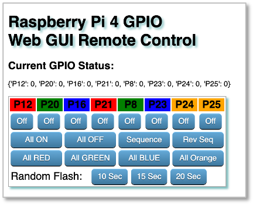

# RaspberryPi_Web_Remote_Control_GUI
 Remotely control the GPIO pins on Raspberry Pi via a web interface



Full instructions are in the included Tutorial PDF. 

Create a folder on your Raspberry Pi called WebServer, then copy the files into this structure:
```
.
├── pi_webapp.py
├── static
│   └── style.css
└── templates
    └── index.html
```
Requires installation of Flask and RPi.GPIO packages on your Raspberry Pi.

Tutorial is written for Raspberry Pi 4, but shoud work on other Raspberry Pi boards as long as they have GPIO headers.
